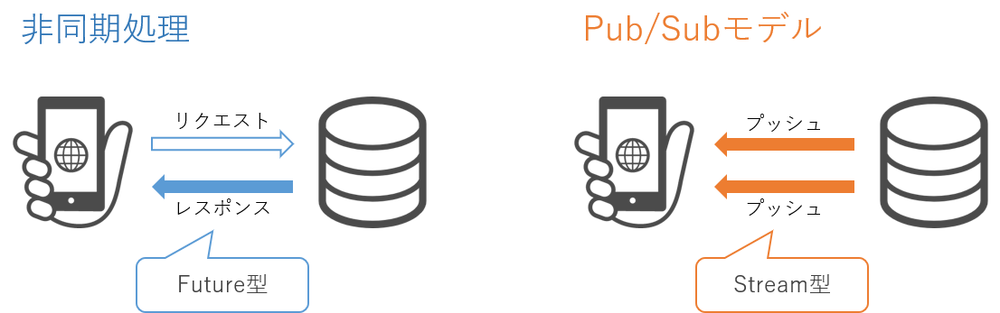

# 5. Firebaseで認証連携を行う

## 1. Firebase Authenticationを有効にする

最初にFirebaseの管理画面からGoogleアカウントの認証機能を有効にしましょう。

次の操作を行ってください。


**work**

* [**Firebase コンソール**](https://console.firebase.google.com)へ移動する
* Authentication > 始める > Sign-in method > 追加プロバイダ > Google を選択
* 「有効にする」を選択 > 「プロジェクトサポートメール」を選択 > 保存を選択
* 承認済みドメイン > ドメインを追加 を選択
* アプリを開いているページのURLを張り付け > 追加を選択




## 2. サインイン・サインアウト機能を実装する

それでは早速、FirebaseのAuthentication使った認証連携を実装しましょう。

次の操作を行ってください


**work**

* `lib/model/auth_model.dart`の以下のコメントアウトを解除
  * `authModelProvider` (最終行はコメントアウト)
  * `signInAuth`
  * `signOutAuth`
  * `getCurrentUser` (最終行はコメントアウト)


```dart
final authModelProvider = StreamProvider.autoDispose((ref) {
+ return FirebaseAuth.instance.authStateChanges();
- // return Stream<User?>.value(null); // 不要なためコメントアウト
});

void signInAuth() {
+  GoogleAuthProvider googleProvider = GoogleAuthProvider();
+  FirebaseAuth.instance.signInWithPopup(googleProvider);
}

void signOutAuth() {
+  FirebaseAuth.instance.signOut();
}

User? getCurrentUser() {
+  final user = FirebaseAuth.instance.currentUser;
+  if (user != null) {
+    return user;
+  } else {
+    return null;
+  }
-  // return null; // 不要なためコメントアウト
}
```



* webサーバーをリロードする（実行を止めてしまった場合は再実行）。

```bash
flutter run -d web-server --web-port=8080 --web-renderer html
```


右上のサインインボタンからサインインを行ってみましょう。

Firebase コンソール の Authentication > Users に自分の情報が登録されていれば成功です。

### 解説

簡単に解説を行います。

まずは `authModelProvider` を確認してください。

ここでは **FirebaseAuth.instance.authStateChanges** というメソッドでFirebaseAuthの**認証情報の変化**を**Stream型**で取得しています。

Stream型とは対象からの通知によりデータ取得する場合(Pub/Subモデル)に利用される型です。



`authModelProvider`は以下のように利用します。

* `useProvider`を使ってView側で呼び出す。
* `.when`メソッドでデータ取得後(data)、データ取得中(loading)、エラー時(error)の処理を記述。

例として`timeline/timeline_view.dart`の`_authButton`を確認してみましょう。


```dart
  Widget _authButton() {
    final user = useProvider(authProvider);
    return user.when(
      data: (user) {
        if (user == null) {
          return _signInButton();
        } else {
          return _signOutButton();
        }
      },
      loading: () => const CircularProgressIndicator(),
      error: (err, stackTrace) => Text(err.toString()),
    );
  }
```


次に`signInAuth`と`signOutAuth`を確認してください。

ここではGoogle認証を行う処理を記述しています。非常に短く記述することが出来ます。

`timeline_viewmodel.dart`を経由して`timeline_view.dart`の`_signInButton`と`_signOutButton`で利用されています。




```dart
import '/model/auth_model.dart';

void signIn() {
  signInAuth();
}

void signOut() {
  signOutAuth();
}
```





```dart
  Widget _signInButton() {
    return IconButton(
      onPressed: () {
        signIn();
      },
      icon: const Icon(Icons.login),
    );
  }

  Widget _signOutButton() {
    return IconButton(
      onPressed: () {
        signOut();
      },
      icon: const Icon(Icons.logout),
    );
  }
```




最後に`getCurrentUser`を確認してください。

ここで利用されている**FirebaseAuth.instance.currentUser**は取得済みのユーザー情報を利用する際に使われるメソッドです。

.(ドット)を使ってdisplayNameやuidにアクセスできます。

`postmodal/postmodal_viewmodel.dart`の`addPost`を確認してみてください。


```dart
  void addPost() {
    final user = getCurrentUser();
    if (user != null) {
      state = state.copyWith(
        user: user.displayName.toString(),
        uid: user.uid,
        photoURL: user.photoURL.toString(),
        timeStamp: DateTime.now(),
      );
    } else {
      state = state.copyWith(
        user: 'anonymous',
        uid: 'anonymous',
        timeStamp: DateTime.now(),
      );
    }
    addPostDB(state);
  }
```

