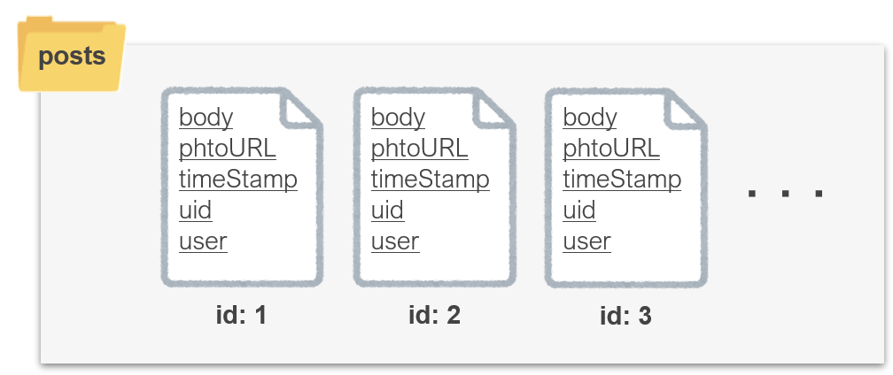

# 6. FireStoreでDB連携を行う

## 1. Cloud Firestore とは <a href="1-cloud-firestore-toha" id="1-cloud-firestore-toha"></a>


Firebase が標準で用意している **NoSQL** の DB です。

ここで **RDB** と **NoSQL** の違いを説明しておきます。

**RDB** とは**データの整合性**に重点を置き、データを比較/調整しながらを処理する DB の事です。\
Oracle Database、MySQL などはこれを操作するため **RDBMS** と呼ばれます。

**NoSQL** とは RDB 以外の全ての DB の事を指します。\
データの整合性よりも**早く処理できること**を優先しているという特徴があります。

特徴を比較すると以下のようになります。

|                           | RDB                                           | NoSQL                                      |
| ------------------------- | --------------------------------------------- | ------------------------------------------ |
| 重点                        | データの整合性を重視                                    | 処理が速く軽量である点を重視                             |
| データ形式                     | 行列による管理                                       | json/ドキュメント/Key-Value 指向など様々               |
| データ操作                     | SQL 文を利用                                      | DB ごとに独自実装、共通言語は無い                         |
| <p>分散性<br>(多拠点展開への対応)</p> | 低い                                            | 高い                                         |
| サービス例                     | <p>Oracle Database<br>MySQL<br>PostgreSQL</p> | <p>Cloud Firestore<br>MongoDB<br>Redis</p> |

Cloud Firestore はドキュメント指向の NoSQL になります。\
**コレクション**と**ドキュメント**ごとに**オブジェクト**でデータを管理することができます。

## 2. DB 設計 <a href="1-cloud-firestore-toha" id="1-cloud-firestore-toha"></a>

今回のDBの設計は次のようになっています。（かなりシンプルなものにしています）

| Collection | Document       | Field     |
| ---------- | -------------- | --------- |
| posts      | posts.id(自動発行) | body      |
|            |                | photoURL  |
|            |                | timeStamp |
|            |                | uid       |
|            |                | user      |

図にすると次のようなイメージになります。



## 3. Firestoreを有効にする

Firestoreを有効にします。次の操作を行ってください。


### work

* [**Firebase コンソール**](https://console.firebase.google.com)へ移動する
* Firestore Database > データベースの作成 を選択
* テストモードで開始する > 次へ > asia-northeast1 > 有効にする を選択




## 3. データを書き込む処理を実装する

データを書き込む処理を実装しましょう。次の操作を行ってください。


* `model/posts_model.dart`の`addPstDB`のコメントアウトを解除。


```dart
void addPostDB(Post post) async {
+  await FirebaseFirestore.instance.collection('posts').add(post.toJson());
}
```


* webサーバーをリロードする（実行を止めてしまった場合は再実行）。

```bash
flutter run -d web-server --web-port=8080 --web-renderer html
```


投稿ボタンを押すことで、Firestoreにデータが追加されることを確認しましょう。

### 解説

Firestoreにデータを書き込む方法はいくつかありますが、今回は**add**を使って**postsコレクション**にデータを追加しています。

また、postクラスのままだとFirestoreに追加できないので、toJsonメソッド\*でjson形式にしています。

\*toJsonメソッドは[freezed](https://app.gitbook.com/s/-MkUYx1nH-LtZrLYKsQ9-103505250/6-flutterdenonitsuite#freezed)の機能です。

## &#x20;4. データを取得する処理を実装する

次にFirestoreからデータを取得します。次の操作を行ってください。


* `model/posts_model.dart`の`postsModelProvider`のコメントアウトを解除、最終行はコメントアウトしてください。


```dart
final postsModelProvider = StreamProvider.autoDispose((ref) {
+  final stream = FirebaseFirestore.instance
+      .collection('posts')
+      .orderBy('timeStamp')
+      .snapshots();
+      .map(
+        (snapshot) => snapshot.docs.map(
+          (doc) => Post.fromJson(doc.data()),
+        ),
+      );
+ return posts;
- //return Stream<Iterable<Post>>.value([]); // 不要なためコメントアウト
});

```


* webサーバーをリロードする（実行を止めてしまった場合は再実行）。

```bash
flutter run -d web-server --web-port=8080 --web-renderer html
```


これでFirestoreのデータが投稿カードとしてアプリに表示されるようになりました。

### 解説

`postsModelProvider`を確認してください。

ここでもAuthと同じStream型とするため`StreamProvider`を利用しています。

メソッドの中では、`.collection`でpostsを指定し、`.orderBy`で時間順に並び替え、`.snapshots`でデータをStream型で受け取っています。受け取ったデータはjson形式のため、fromJsonメソッド\*\*でpost型に変換して受け取るようにしています。

\*\*fromJsonメソッドも[freezed](https://app.gitbook.com/s/-MkUYx1nH-LtZrLYKsQ9-103505250/6-flutterdenonitsuite#freezed)の機能です。
